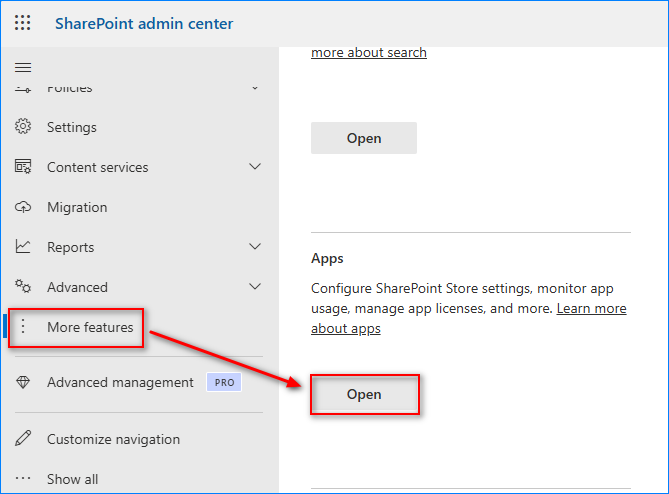
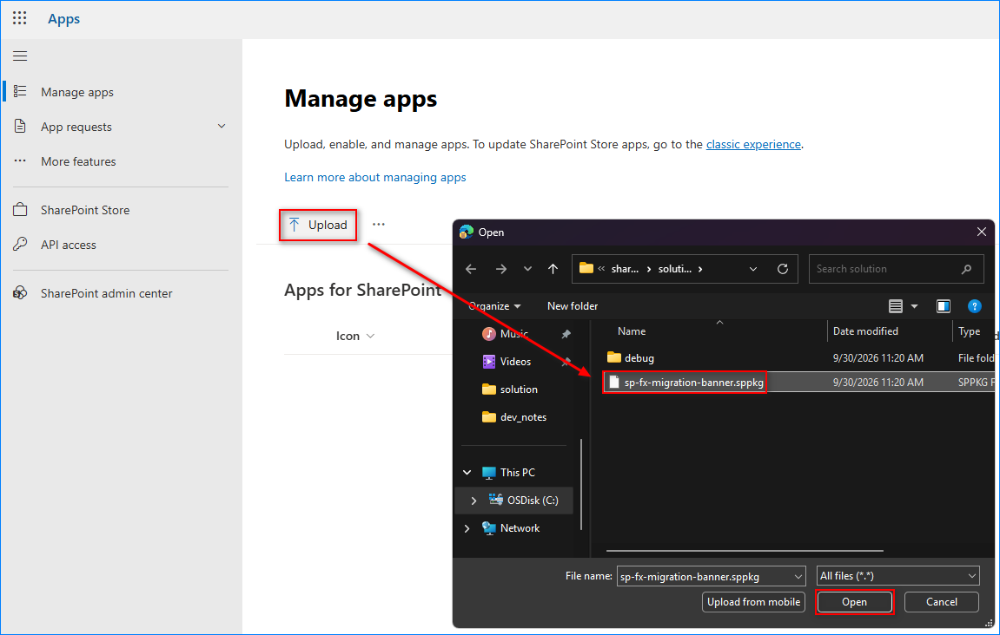
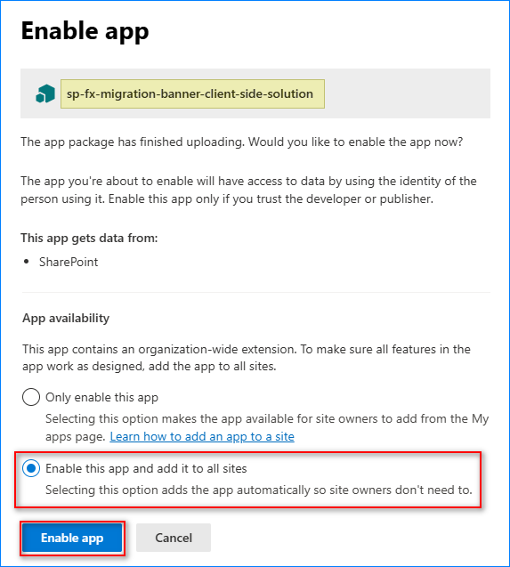
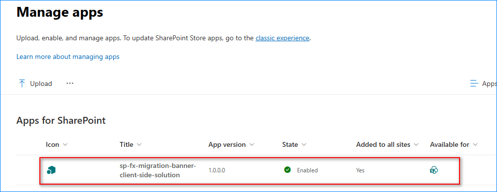
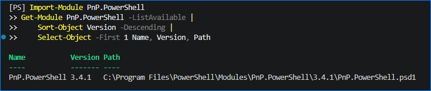
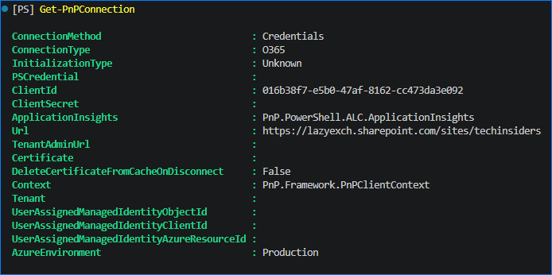
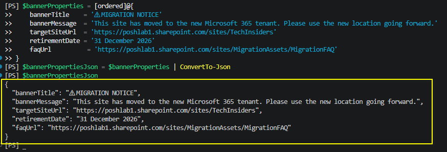
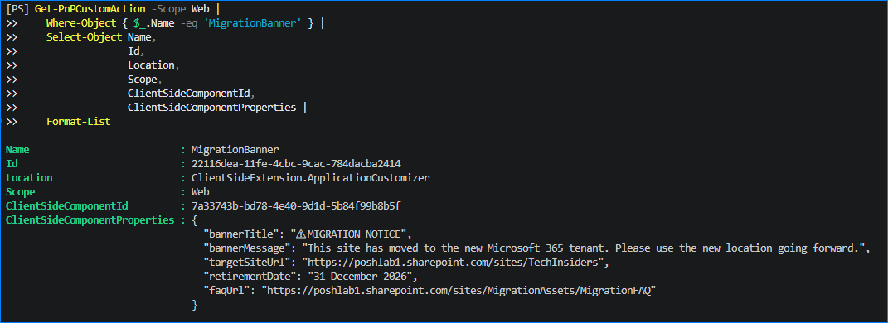
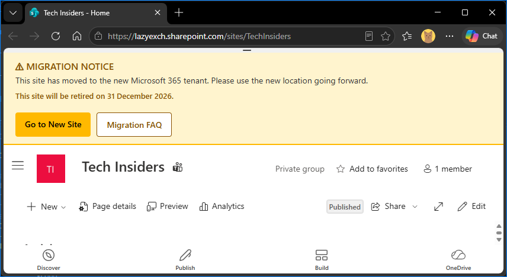
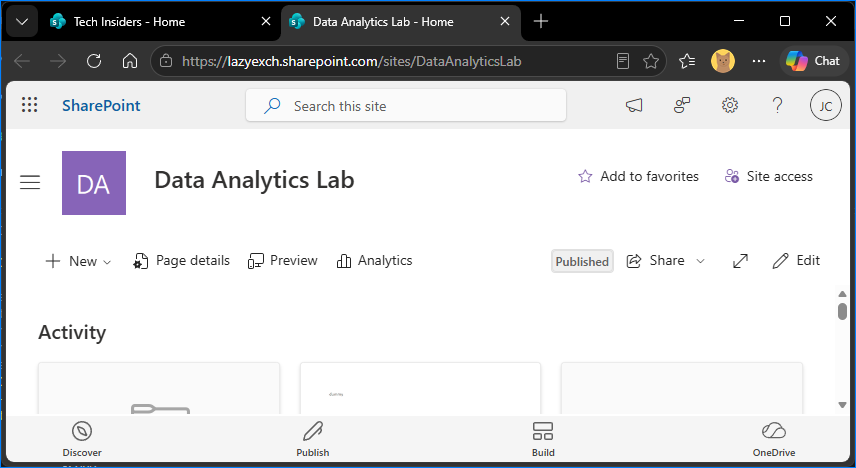

# Package Deployment and Activation Example

This guide provides a complete example for deploying the **SPFx Migration Banner** package tenant-wide and activating a configured banner on one SharePoint Online site.

The example uses the following environment:

- **SharePoint Admin Center:** [Open the LazyExch SharePoint Admin Center](https://lazyexch-admin.sharepoint.com)
- **Source or old site:** [Open the Tech Insiders source site](https://lazyexch.sharepoint.com/sites/TechInsiders)
- **Target or new site:** [Open the Tech Insiders target site](https://poshlab1.sharepoint.com/sites/TechInsiders)
- **Migration FAQ:** [Open the Migration FAQ](https://poshlab1.sharepoint.com/sites/MigrationAssets/MigrationFAQ)
- **SPFx component ID:** `7a33743b-bd78-4e40-9d1d-5b84f99b8b5f`
- **Package name:** `sp-fx-migration-banner.sppkg` - [Get it here](../sharepoint/solution/sp-fx-migration-banner.sppkg)

> The package is deployed tenant-wide, but the banner is displayed only on sites where a site-scoped custom action supplies a non-empty `targetSiteUrl` property.

## Deployment flow

```text
Build or obtain the .sppkg package
                |
                v
Upload to the Tenant App Catalog
                |
                v
Deploy the package tenant-wide
                |
                v
Connect to the source site with PnP PowerShell
                |
                v
Create a web-scoped Application Customizer custom action
                |
                v
Validate the banner and links
```

## Prerequisites

Before starting, confirm that:

- The tenant App Catalog already exists.
- The administrator can access the SharePoint Admin Center and tenant App Catalog.
- The administrator has permission to deploy applications from the App Catalog.
- PowerShell 7 is installed.
- PnP PowerShell is installed.
- The latest production package is available:

  ```text
  sharepoint/solution/sp-fx-migration-banner.sppkg
  ```

- The package was generated from a successful production build:

  ```powershell
  npm run build
  ```

- The deployed build contains the guard that prevents an unconfigured tenant-wide instance from displaying a default banner:

  ```typescript
  const targetSiteUrl = this.properties.targetSiteUrl;

  if (!targetSiteUrl) {
    return;
  }
  ```

## Part 1: Upload and deploy the package tenant-wide

### Step 1: Open the SharePoint Admin Center

Open the [LazyExch SharePoint Admin Center](https://lazyexch-admin.sharepoint.com).

Sign in with an account that has the permissions required to manage the tenant App Catalog.

> **Screenshot placeholder 01:** SharePoint Admin Center home page
>
> Suggested file: `images/01-sharepoint-admin-center.png`

### Step 2: Open the tenant App Catalog

From the SharePoint Admin Center:

1. Select **More features**.
2. Locate **Apps**.
3. Select **Open**.
4. Open the tenant App Catalog.
5. Select **Apps**.

If the direct App Catalog address is already known, the administrator may open it directly instead.



### Step 3: Upload the SPFx package

Upload the following file to **Apps for SharePoint**:

```text
sp-fx-migration-banner.sppkg
```



If an older version already exists, replace the existing package when prompted.

Before continuing, verify that the uploaded file has the expected name and modified date.

### Step 4: Deploy the package tenant-wide

In the deployment confirmation dialog:

1. Review the solution name and publisher information.
2. Select **Enable this app and add it to all sites**.
3. Select **Deploy**.



Tenant-wide deployment makes the SPFx extension available across the tenant without requiring administrators to install the app separately on every site.

The banner should not appear merely because the package is available tenant-wide. The solution code is expected to stop rendering when `targetSiteUrl` is absent. The site-specific custom action created later provides the required configuration.

### Step 5: Verify the App Catalog deployment

In **Apps for SharePoint**, verify that:

- The package is present.
- The package is deployed.
- The package is enabled.
- The package indicates tenant-wide availability, when shown by the App Catalog interface.



## Part 2: Activate and configure the banner on the source site

The following steps configure the migration banner on the [Tech Insiders source site](https://lazyexch.sharepoint.com/sites/TechInsiders).

### Step 6: Install or update PnP PowerShell

Open PowerShell 7.

To install PnP PowerShell for the current user:

```powershell
Install-Module PnP.PowerShell -Scope CurrentUser
```

If PnP PowerShell is already installed, verify that the module can be imported:

```powershell
Import-Module PnP.PowerShell
Get-Module PnP.PowerShell -ListAvailable |
    Sort-Object Version -Descending |
    Select-Object -First 1 Name, Version, Path
```

Use the authentication configuration approved for the tenant. Some environments require an Entra ID application or client ID when connecting with PnP PowerShell.



### Step 7: Define the source site and component ID

```powershell
$sourceSiteUrl = 'https://lazyexch.sharepoint.com/sites/TechInsiders'
$componentId = '7a33743b-bd78-4e40-9d1d-5b84f99b8b5f'
$appId = '016b38f7-e5b0-47af-8162-cc473da3e092'
```

> [!NOTE]
> `$appId` value is your registered [interactive PnP PowerShell application ID](https://pnp.github.io/powershell/articles/registerapplication#setting-up-access-to-your-own-entra-id-app-for-interactive-login)

### Step 8: Connect to the source site

```powershell
Connect-PnPOnline `
    -Url $sourceSiteUrl `
    -Interactive `
    -ApplicationId $pnpAppId
```

Complete the interactive sign-in using an account that can manage custom actions on the source site.

Verify the connection by running `Get-PnPConnection`



### Step 9: Define the banner properties

Create the configuration as a PowerShell object, then convert it to compressed JSON. This avoids errors caused by manually escaped quotation marks or broken lines.

```powershell
$bannerProperties = [ordered]@{
    bannerTitle    = '⚠ MIGRATION NOTICE'
    bannerMessage  = 'This site has moved to the new Microsoft 365 tenant. Please use the new location going forward.'
    targetSiteUrl  = 'https://poshlab1.sharepoint.com/sites/TechInsiders'
    retirementDate = '31 December 2026'
    faqUrl          = 'https://poshlab1.sharepoint.com/sites/MigrationAssets/MigrationFAQ'
}

$bannerPropertiesJson = $bannerProperties | ConvertTo-Json -Compress

$bannerPropertiesJson
```

Expected JSON structure:

```json
{"bannerTitle":"⚠ MIGRATION NOTICE","bannerMessage":"This site has moved to the new Microsoft 365 tenant. Please use the new location going forward.","targetSiteUrl":"https://poshlab1.sharepoint.com/sites/TechInsiders","retirementDate":"31 December 2026","faqUrl":"https://poshlab1.sharepoint.com/sites/MigrationAssets/MigrationFAQ"}
```



### Step 10: Check for an existing migration-banner custom action

```powershell
$existingBannerActions = Get-PnPCustomAction -Scope Web |
    Where-Object { $_.Name -eq 'MigrationBanner' }

$existingBannerActions |
    Select-Object Name,
                  Id,
                  Location,
                  Scope,
                  ClientSideComponentId,
                  ClientSideComponentProperties |
    Format-List
```

If no result is returned, proceed to the next step.

If one or more results are returned, remove them before creating the configured custom action. This prevents duplicate site-scoped banners.

```powershell
$existingBannerActions |
    ForEach-Object {
        Remove-PnPCustomAction `
            -Identity $_.Id `
            -Scope Web `
            -Force
    }
```

Run the check again:

```powershell
Get-PnPCustomAction -Scope Web |
    Where-Object { $_.Name -eq 'MigrationBanner' }
```

<!-- > **Screenshot placeholder 10:** Existing custom action query, before removal if applicable
>
> Suggested file: `images/10-existing-custom-action.png` -->

### Step 11: Add the configured custom action

```powershell
Add-PnPCustomAction `
    -Name 'MigrationBanner' `
    -Title 'MigrationBanner' `
    -Location 'ClientSideExtension.ApplicationCustomizer' `
    -ClientSideComponentId $componentId `
    -ClientSideComponentProperties $bannerPropertiesJson `
    -Scope Web
```

This creates a web-scoped Application Customizer action on the source site. The action supplies the site-specific destination URL, migration message, retirement date, and FAQ URL to the tenant-wide SPFx package.


### Step 12: Verify the created custom action

```powershell
Get-PnPCustomAction -Scope Web |
    Where-Object { $_.Name -eq 'MigrationBanner' } |
    Select-Object Name,
                  Id,
                  Location,
                  Scope,
                  ClientSideComponentId,
                  ClientSideComponentProperties |
    Format-List
```

Verify the following values:

```text
Name: MigrationBanner
Location: ClientSideExtension.ApplicationCustomizer
Scope: Web
ClientSideComponentId: 7a33743b-bd78-4e40-9d1d-5b84f99b8b5f
```

Also verify that `ClientSideComponentProperties` contains:

- The target site URL
- The retirement date
- The FAQ URL
- Valid JSON syntax

The custom-action `Id` displayed by SharePoint is the ID of that custom-action instance. It is expected to differ from the SPFx `ClientSideComponentId`.



## Part 3: Validate the user experience

### Step 13: Open the source site normally

Open the [Tech Insiders source site](https://lazyexch.sharepoint.com/sites/TechInsiders).

Use the normal site URL without any local development parameters. The URL must not contain:

```text
debugManifestsFile
loadSPFX
customActions
```

If necessary, perform a hard refresh or open a private browser window to rule out cached debug resources.

### Step 14: Verify the banner content

Confirm that the banner displays once and contains:

- `⚠ MIGRATION NOTICE`
- The migration message
- `This site will be retired on 31 December 2026.`
- **Go to New Site**
- **Migration FAQ**



### Step 15: Test the target-site button

Click **Go to New Site**.

Confirm that the browser opens the [Tech Insiders target site](https://poshlab1.sharepoint.com/sites/TechInsiders) in a new tab.

### Step 16: Test the FAQ button

Click **Migration FAQ**.

Confirm that the browser opens the [Migration FAQ](https://poshlab1.sharepoint.com/sites/MigrationAssets/MigrationFAQ) in a new tab.

### Step 17: Confirm that unconfigured sites remain unaffected

Open another modern SharePoint site in the LazyExch tenant that does not have a `MigrationBanner` custom action.

Confirm that no migration banner is displayed.

This check verifies that the tenant-wide package is available without causing an unconfigured default banner across the tenant.



## Rollback: remove the banner from the source site

Connect to the source site if the current PowerShell session is not already connected:

Remove the web-scoped migration-banner custom action:

```powershell
Get-PnPCustomAction -Scope Web |
    Where-Object { $_.Name -eq 'MigrationBanner' } |
    ForEach-Object {
        Remove-PnPCustomAction `
            -Identity $_.Id `
            -Scope Web `
            -Force
    }
```

Verify removal:

```powershell
Get-PnPCustomAction -Scope Web |
    Where-Object { $_.Name -eq 'MigrationBanner' }
```

Refresh the source site and confirm that the banner is no longer displayed.

Removing the site-scoped custom action does not retract or delete the tenant-wide SPFx package.

## Troubleshooting

### The banner does not appear

Verify:

1. The latest `.sppkg` is deployed in the tenant App Catalog.
2. The package was deployed tenant-wide.
3. The custom action exists on the source site's web scope.
4. `ClientSideComponentId` is `7a33743b-bd78-4e40-9d1d-5b84f99b8b5f`.
5. `targetSiteUrl` is present and non-empty.
6. `ClientSideComponentProperties` is valid JSON.
7. The page is a supported modern SharePoint experience.
8. The browser URL contains no local debug parameters.

### Two banners appear

Two banners normally indicate that two Application Customizer instances are rendering.

Check for duplicate web-scoped custom actions:

```powershell
Get-PnPCustomAction -Scope Web |
    Where-Object {
        $_.ClientSideComponentId -eq '7a33743b-bd78-4e40-9d1d-5b84f99b8b5f'
    } |
    Select-Object Name, Id, Scope, ClientSideComponentProperties |
    Format-List
```

Remove duplicate site-scoped actions. Also verify that the unconfigured tenant-wide instance exits when `targetSiteUrl` is missing.

### The package was deployed without tenant-wide availability

If the package was not made available tenant-wide, the app must be installed on the individual site through **Site contents > Add an app** before SharePoint can load the component.

Installing the app on the site may also activate an Application Customizer from package feature definitions. Adding another PnP custom action can then produce a duplicate banner. For this documented deployment model, use tenant-wide package availability and site-specific custom-action properties.

### The buttons open the wrong locations

Inspect the stored configuration:

```powershell
Get-PnPCustomAction -Scope Web |
    Where-Object { $_.Name -eq 'MigrationBanner' } |
    Select-Object -ExpandProperty ClientSideComponentProperties
```

Confirm these exact values:

```text
Target site: https://poshlab1.sharepoint.com/sites/TechInsiders
FAQ: https://poshlab1.sharepoint.com/sites/MigrationAssets/MigrationFAQ
```

If either value is incorrect, remove and recreate the custom action using the complete activation script.

## References

- [Microsoft Learn: Tenant-scoped solution deployment for SharePoint Framework solutions](https://learn.microsoft.com/en-us/sharepoint/dev/spfx/tenant-scoped-deployment)
- [Microsoft Learn: Tenant-wide deployment of SharePoint Framework extensions](https://learn.microsoft.com/en-us/sharepoint/dev/spfx/extensions/basics/tenant-wide-deployment-extensions)
